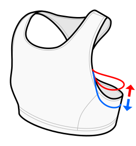

This option adjusts the bottom of the armhole.

In my prototypes, the default value fits quite well without digging in, but you may find that you need to adjust this.

This option is affected by the accuracy of the _waist-to-armpit_ measurement.

