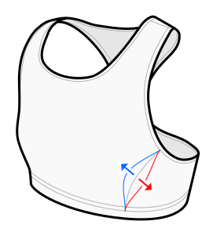

This option determines how much the front side seams aim at the bust point.

A value of 100% puts the seam close to the bust point,
which can potentially result in a more form fitting bust shape and more even stretching,
but the seams can be uncomfortable and it can increase the sewing difficulty.

Negative values shift the seam away from your bust point.

Leave this at the default value if unsure.

