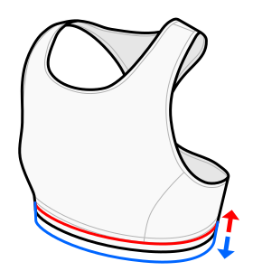

This controls the width of the elastic band you'll use for your under-bust band (or waistband).

This is a _snapped percentage option_, which means that it is a percentage
option that you can tweak, but rather than using an exact percentage, it will
_snap_ to the nearest fixed value configured on the option. In this case, that
is a list of standard elastic widths. This should ensure that no matter what
value you choose, you always end up with an elastic width that is actually for
sale, rather than some arbitrary value.

I don't recommend going below 10 mm, as this will either not give enough support or dig in uncomfortably.

