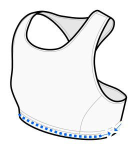

This option determines the negative ease of the **main fabric** at the height of the under bust band (or waistband).

You can (and probably should) add additional stretch to the elastic band hidden inside the main fabric.
This is not what this option is about.
This option is solely for the stretch of the outer fabric.

