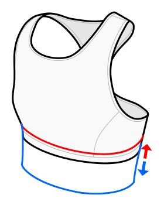

This option determines the length of the top.

At 0% the band will sit directly below the bust and start at the under bust measurement.

At 100% the waistband will start at the waistline (and extend below it).

Since the fabric can stretch in various ways, the resulting length is not super predictable.
The final length of the bra will also depend on the vertical stretch and strap stretch options and how you wear it.

